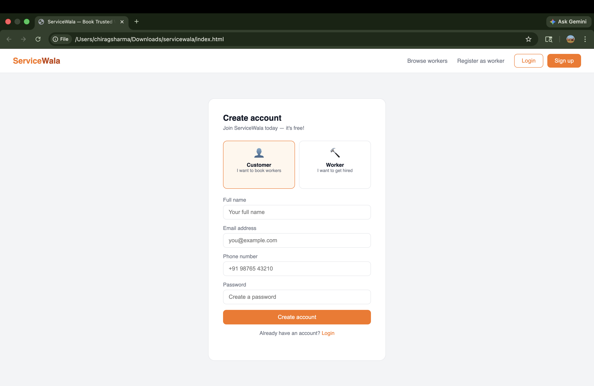

# 🚀 ServiceWala
A simple service booking web application where users can connect with local service providers.

1)Features
* User Login & Registration
* Worker Dashboard
* Booking System
* Toast Notifications
* Simple Navigation System
2) Tech Stack
* HTML
* CSS
* JavaScript

3)Limitations
* No backend (data stored in memory)
* No database
* Data resets on refresh

4)Future Improvements
* Add backend (Spring Boot)
* Add database (MySQL)
* Authentication (JWT)
* Convert to React

5)Screenshots
Login Page

Dashboard

 Signup

   
6) Author
Chirag Sharma
